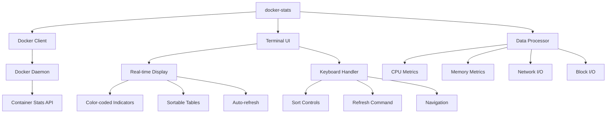
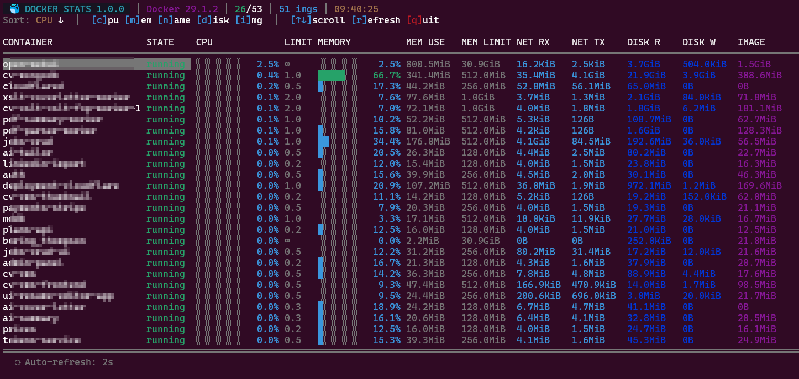

# Docker Stats Monitor

[](https://golang.org/)
[](LICENSE)
[](https://github.com/spagu/docker-stats/releases/latest)
[](https://github.com/spagu/docker-stats/actions/workflows/ci.yml)
[](https://codecov.io/gh/spagu/docker-stats)
[](https://github.com/spagu/docker-stats/releases)
[](https://github.com/spagu/docker-stats/actions/workflows/codeql.yml)
[](https://goreportcard.com/report/github.com/spagu/docker-stats)

A real-time terminal UI tool for monitoring Docker container statistics, similar to `top` or `htop` for Linux systems.

## Architecture





## Features

- 📊 **Real-time statistics** - CPU, Memory, Network I/O, Block I/O
- 🎨 **Color-coded indicators** - Visual resource usage warnings
- ⌨️ **Keyboard navigation** - Sort, refresh, and navigate with hotkeys
- 🔄 **Auto-refresh** - Configurable refresh interval
- 📦 **Lightweight** - Single binary, no dependencies

## Installation

### Pre-compiled Binaries (Recommended)

Download the appropriate binary for your platform and architecture from the [latest release](https://github.com/spagu/docker-stats/releases/latest):

#### Linux
```bash
# AMD64 (Intel/AMD)
wget https://github.com/spagu/docker-stats/releases/latest/download/docker-stats-$(curl -s https://api.github.com/repos/spagu/docker-stats/releases/latest | grep '"tag_name"' | cut -d'"' -f4)-linux-amd64.tar.gz
tar -xzf docker-stats-*-linux-amd64.tar.gz
sudo mv docker-stats /usr/local/bin/

# ARM64 (ARM)
wget https://github.com/spagu/docker-stats/releases/latest/download/docker-stats-$(curl -s https://api.github.com/repos/spagu/docker-stats/releases/latest | grep '"tag_name"' | cut -d'"' -f4)-linux-arm64.tar.gz
tar -xzf docker-stats-*-linux-arm64.tar.gz
sudo mv docker-stats /usr/local/bin/
```

#### macOS
```bash
# Intel
wget https://github.com/spagu/docker-stats/releases/latest/download/docker-stats-$(curl -s https://api.github.com/repos/spagu/docker-stats/releases/latest | grep '"tag_name"' | cut -d'"' -f4)-darwin-amd64.tar.gz
tar -xzf docker-stats-*-darwin-amd64.tar.gz
sudo mv docker-stats /usr/local/bin/

# Apple Silicon (M1/M2)
wget https://github.com/spagu/docker-stats/releases/latest/download/docker-stats-$(curl -s https://api.github.com/repos/spagu/docker-stats/releases/latest | grep '"tag_name"' | cut -d'"' -f4)-darwin-arm64.tar.gz
tar -xzf docker-stats-*-darwin-arm64.tar.gz
sudo mv docker-stats /usr/local/bin/
```

#### Windows
```powershell
# Download and extract (PowerShell)
$version = (Invoke-RestMethod -Uri "https://api.github.com/repos/spagu/docker-stats/releases/latest" | Select-Object -ExpandProperty tag_name)
Invoke-WebRequest -Uri "https://github.com/spagu/docker-stats/releases/latest/download/docker-stats-$version-windows-amd64.zip" -OutFile "docker-stats.zip"
Expand-Archive -Path "docker-stats.zip" -DestinationPath "."
Move-Item "docker-stats.exe" -Destination "$env:USERPROFILE\Local\Programs\docker-stats\"
```

#### FreeBSD
```bash
# AMD64 only
wget https://github.com/spagu/docker-stats/releases/latest/download/docker-stats-$(curl -s https://api.github.com/repos/spagu/docker-stats/releases/latest | grep '"tag_name"' | cut -d'"' -f4)-freebsd-amd64.tar.gz
tar -xzf docker-stats-*-freebsd-amd64.tar.gz
sudo mv docker-stats /usr/local/bin/
```

### From Source

```bash
# Clone the repository
git clone https://github.com/spagu/docker-stats.git
cd docker-stats

# Build
make build

# Or install to /usr/local/bin
make install
```

### Quick Build

```bash
go build -o docker-stats .
```

## Usage

```bash
# Run with default settings (2s refresh)
./docker-stats

# Custom refresh interval
./docker-stats -interval 5s

# Show all containers (including stopped)
./docker-stats -all

# Show help
./docker-stats -help

# Show version
./docker-stats -version
```

## Keyboard Shortcuts

| Key | Action |
|-----|--------|
| `q` / `Ctrl+C` | Quit |
| `r` | Force refresh |
| `c` | Sort by CPU usage |
| `m` | Sort by Memory usage |
| `n` | Sort by container Name |
| `↑` / `↓` | Navigate containers |

## Columns

| Column | Description |
|--------|-------------|
| **NAME** | Container name |
| **STATUS** | Container state (running, stopped, etc.) |
| **CPU%** | CPU usage percentage |
| **MEM USAGE** | Memory usage (used / limit) |
| **MEM%** | Memory usage percentage |
| **NET I/O** | Network input/output bytes |
| **BLOCK I/O** | Disk read/write bytes |
| **PIDS** | Number of processes |
| **IMAGE SIZE** | Size of the container image |

## Color Coding

### CPU Usage
- ⬜ White: < 20%
- 🟩 Green: 20-50%
- 🟨 Yellow: 50-80%
- 🟥 Red: > 80%

### Memory Usage
- ⬜ White: < 40%
- 🟩 Green: 40-70%
- 🟨 Yellow: 70-90%
- 🟥 Red: > 90%

## Development

### Prerequisites

- Go 1.25 or later
- Docker daemon running
- User must have permissions to access Docker socket

### Build Commands

```bash
# Install dependencies
make deps

# Format code
make fmt

# Run linter
make lint

# Run tests
make test

# Run tests with coverage
make test-coverage

# Security scan
make security

# Build binary
make build

# Build for all platforms
make build-all

# Run all checks
make all
```

### Install Development Tools

```bash
make dev-tools
```

This installs:
- `golangci-lint` - Linter
- `gosec` - Security scanner
- `govulncheck` - Vulnerability checker
- `goimports` - Import formatter

## Project Structure

```
stats/
├── main.go                 # Entry point
├── go.mod                  # Go module definition
├── go.sum                  # Dependency checksums
├── Makefile                # Build automation
├── README.md               # This file
├── .gitignore              # Git ignore rules
└── internal/
    ├── docker/
    │   ├── client.go       # Docker client wrapper
    │   ├── client_test.go  # Client tests
    │   └── format.go       # Formatting utilities
    └── ui/
        ├── app.go          # Terminal UI application
        └── app_test.go     # UI tests
```

## Requirements

- Docker daemon must be running
- User must have permissions to access Docker socket (typically member of `docker` group or root)

```bash
# Add user to docker group (requires logout/login)
sudo usermod -aG docker $USER
```

## Troubleshooting

### "Cannot connect to Docker daemon"

Ensure Docker is running:
```bash
sudo systemctl start docker
```

### "Permission denied"

Add your user to the docker group:
```bash
sudo usermod -aG docker $USER
# Then logout and login again
```

### No containers shown

Check if containers are running:
```bash
docker ps
```

Use `-all` flag to show stopped containers:
```bash
./docker-stats -all
```

## License

BSD 3-Clause License - see [LICENSE](LICENSE) for details.

## Related

- [docker stats](https://docs.docker.com/engine/reference/commandline/stats/) - Official Docker stats command
- [ctop](https://github.com/bcicen/ctop) - Top-like interface for container metrics
- [lazydocker](https://github.com/jesseduffield/lazydocker) - Terminal UI for Docker
