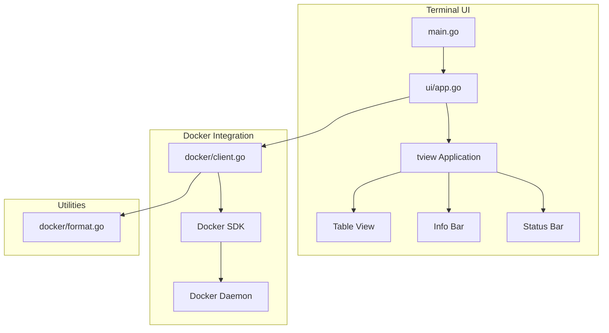
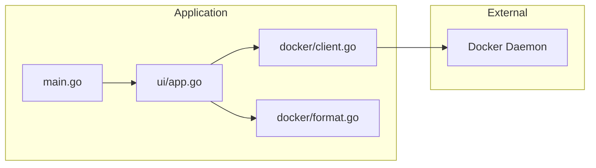
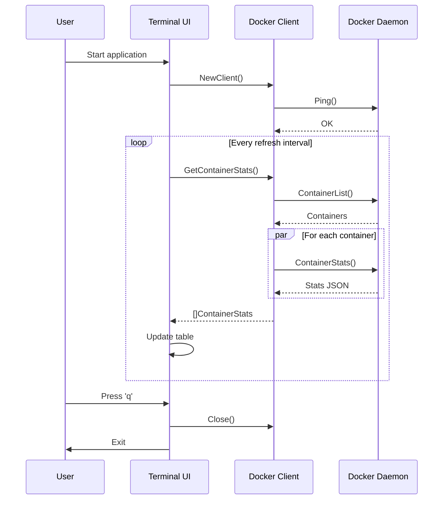

# Architecture

## Overview

Docker Stats Monitor is a terminal-based application for real-time Docker container monitoring. It follows a clean architecture with separation of concerns.

## High-Level Architecture



## Component Diagram



## Data Flow



## Package Structure

```
stats/
├── main.go                 # Entry point, CLI parsing
├── go.mod                  # Module definition
├── go.sum                  # Dependencies
├── Makefile                # Build automation
├── README.md               # User documentation
├── .gitignore              # Git ignore rules
├── docs/
│   └── ARCHITECTURE.md     # This file
└── internal/
    ├── docker/
    │   ├── client.go       # Docker API wrapper
    │   ├── client_test.go  # Client tests
    │   └── format.go       # Formatting utilities
    └── ui/
        ├── app.go          # Terminal UI
        └── app_test.go     # UI tests
```

## Key Components

### main.go

- Entry point
- CLI flag parsing
- Signal handling (SIGINT, SIGTERM)
- Application lifecycle management

### internal/docker/client.go

- Docker SDK wrapper
- Container listing and stats retrieval
- Concurrent stats fetching
- Docker info retrieval

### internal/docker/format.go

- Byte formatting (B, KiB, MiB, GiB, TiB)
- Percentage formatting
- Network/Block I/O formatting

### internal/ui/app.go

- tview-based terminal UI
- Table rendering
- Keyboard input handling
- Color-coded resource indicators
- Auto-refresh loop

## Design Decisions

### Why tview?

- Rich terminal UI components
- Cross-platform support
- Active maintenance
- Good documentation

### Why internal packages?

- Encapsulation of implementation details
- Clear public API boundary
- Prevents external imports

### Concurrent Stats Fetching

Stats are fetched concurrently for all containers to minimize latency:

```go
for _, cont := range containers {
    wg.Add(1)
    go func(cont types.Container) {
        defer wg.Done()
        stats, _ := c.getContainerStats(ctx, cont)
        statsChan <- stats
    }(cont)
}
```

### Color Coding

Resource usage is color-coded for quick visual assessment:

| Resource | Low | Medium | High | Critical |
|----------|-----|--------|------|----------|
| CPU | White (<20%) | Green (20-50%) | Yellow (50-80%) | Red (>80%) |
| Memory | White (<40%) | Green (40-70%) | Yellow (70-90%) | Red (>90%) |

## Dependencies

| Package | Purpose |
|---------|---------|
| `github.com/docker/docker` | Docker SDK |
| `github.com/gdamore/tcell/v2` | Terminal cell library |
| `github.com/rivo/tview` | Terminal UI framework |

## Testing Strategy

- Unit tests for formatting functions
- Unit tests for sorting logic
- Unit tests for color selection
- Integration tests require Docker daemon

## Future Improvements

1. Container details view (Enter key)
2. Log viewing
3. Container actions (start/stop/restart)
4. Export to JSON/CSV
5. Custom column selection
6. Container filtering
